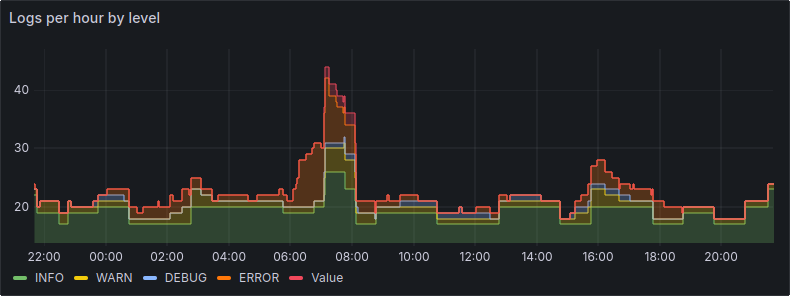
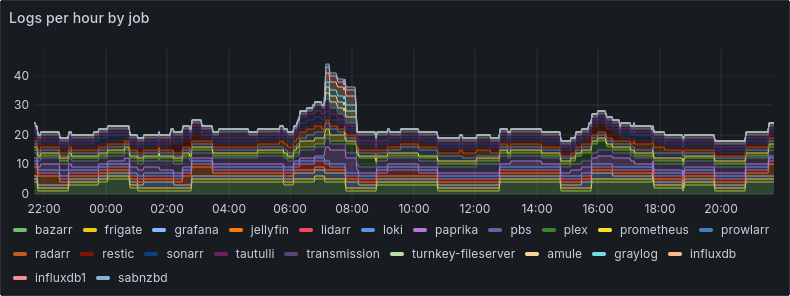
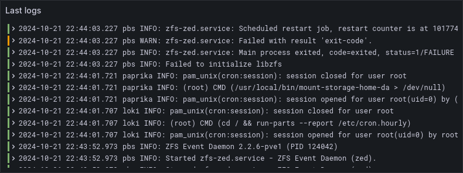
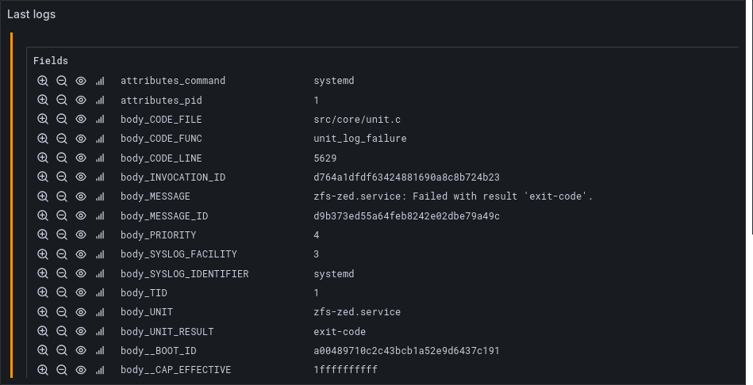

# pve2otelcol

**pve2otelcol** is a program to monitor the VMs running on a [Proxmox Virtual Environment](https://www.proxmox.com/) (*PVE*) node, collecting their logs and sending them to an [OpenTelemetry collector](https://opentelemetry.io/), trying to be as little intrusive as possible.

This means that no agent is needed on individual VMs: logs are collected by a program running on the PVE node itself.

**pve2otelcol** can monitor the [journald](https://www.freedesktop.org/software/systemd/man/latest/systemd-journald.service.html) logs of the PVE node and of each running VM, periodically monitoring them for start and stop events.

The logs, connected in JSON format, are parsed and sent to the OpenTelemetry collector where they can be easily routed, parsed, filtered, inspected and visualized directly in Grafana.

## Disclaimer and limitations

This software is in alpha state; ideas for improvements can be [discussed on Github](https://github.com/alberanid/pve2otelcol/discussions); in the same way, any [bug report](https://github.com/alberanid/pve2otelcol/issues) and pull request is welcome.

At the moment **it can't monitor Qemu/KVM virtual machines**, since running `qm exec VMID -- journalctl --follow` produces no output to be parsed (it's not a stream like the `pct exec VMID -- journalctl --follow` that's used to monitor LXC containers).

## Building it

Just run:

```sh
go build .
```

## Run it

Copy it to a PVE node and run:

```sh
./pve2otelcol --verbose --otlp-grpc-url http://collector.address:4317
```

where *collector.address:4317* is the address and port of an [OpenTelemetry gRPC](https://opentelemetry.io/docs/specs/otlp/) collector.

A popular collector is [Grafana Alloy](https://grafana.com/oss/alloy-opentelemetry-collector/), which is usually deployed along with [Grafana Loki](https://grafana.com/docs/loki/latest/) and the [Grafana visualizer](https://grafana.com/oss/grafana/).

**pve2otelcol** has numerous other command line options, see `./pve2otelcol --help` for more information. The defaults should be reasonable values in most of the cases.

The URL for the selected exporter must include an explicit `http` or `https` scheme and a host. Invalid option values and inconsistent retry intervals are rejected before monitoring starts.

LXC discovery uses the local Proxmox API through `pvesh` and consumes its JSON output. Discovery commands are limited to 10 seconds by default (`--discovery-timeout`), while guest `journalctl` capability probes are limited to 5 seconds (`--capability-probe-timeout`). A successful probe is reused on later refreshes until the discovered container identity changes; a missing capability is checked again so installing `journalctl` does not require restarting the service.

Monitored sources use a type-qualified identity such as `lxc/101`, keeping container and virtual-machine IDs distinct. Successful refreshes also reconcile names and monitoring commands. A renamed source receives a new OpenTelemetry logger provider so subsequent records carry the updated `service.name`; if that provider cannot be created, the existing monitor remains active and the rename is retried during a later refresh.

### Metrics

A Prometheus text endpoint listens on `127.0.0.1:9221` by default. Set `--metrics-listen-address host:port` to change it, or pass an empty value to disable it. Keep a non-loopback listener behind an appropriate firewall or authenticated reverse proxy.

```sh
curl --fail --silent http://127.0.0.1:9221/metrics
```

The endpoint exports:

- `pve2otelcol_discovered_sources`, the size of the latest successful discovery snapshot;
- `pve2otelcol_active_monitors`, including the PVE self-monitor when enabled;
- `pve2otelcol_monitor_restarts_total`;
- `pve2otelcol_journal_parse_failures_total`;
- `pve2otelcol_oversized_records_total`;
- `pve2otelcol_dropped_records_total`, currently records rejected before logger handoff because they exceed the 1 MiB safety limit; and
- `pve2otelcol_exporter_shutdown_failures_total`.

All service diagnostics use structured `slog` attributes such as `source`, `command`, `retry`, and `error`. The default text handler renders them as searchable `key=value` pairs in the systemd journal message.

### TLS

Use an `https` endpoint to verify the collector with the host's system CA certificates:

```sh
./pve2otelcol --otlp-grpc-url https://collector.example:4317
```

For a collector certificate issued by a private CA, append that CA to the system trust pool with `--otlp-tls-ca-file`:

```sh
./pve2otelcol \
  --otlp-grpc-url https://collector.example:4317 \
  --otlp-tls-ca-file /etc/pve2otelcol/collector-ca.pem
```

If the collector requires mutual TLS, also provide the client identity certificate and its matching private key. These files are used only for client authentication; the client certificate is not treated as a server trust root.

```sh
./pve2otelcol \
  --otlp-grpc-url https://collector.example:4317 \
  --otlp-tls-ca-file /etc/pve2otelcol/collector-ca.pem \
  --otlp-tls-cert-file /etc/pve2otelcol/client.pem \
  --otlp-tls-key-file /etc/pve2otelcol/client-key.pem
```

The certificate and key options must be supplied together, and all TLS file options require the selected gRPC or HTTP endpoint to use `https`.

### Delivery guarantees

Journal cursors are checkpointed per source under `/var/lib/pve2otelcol/cursors` by default. When a monitoring command restarts, the saved cursor is passed to `journalctl --after-cursor`, so records written during the restart can be replayed instead of silently skipped. Use `--cursor-dir` to select another state directory, or pass an empty value to disable persistence.

Delivery is best effort, not exactly once. A checkpoint advances after a record is handed to the in-process OpenTelemetry logger, not after the collector acknowledges it. Consequently, an abrupt process or host failure can lose records still buffered in memory. Conversely, a crash before the latest cursor checkpoint is persisted can replay a suffix and produce duplicates. Exporter queue pressure or a collector outage can also lose records according to the OpenTelemetry SDK's batching behavior. Graceful shutdown reduces this risk by stopping producers before flushing every logger provider, but cannot turn OTLP batching into durable storage.

Malformed JSON records are forwarded as strings. Records larger than 1 MiB are rejected, counted as oversized and dropped, and cause that monitor attempt to restart. Monitor retries and cursor replay preserve ordering only within each individual journal source; there is no ordering guarantee across sources.

Structured journal values retain their native OpenTelemetry type where one exists. Unsigned integers too large for OTLP's signed 64-bit integer type are preserved as exact decimal strings, JSON null is represented as the string `"null"`, and otherwise unsupported values retain their formatted text. Metadata such as timestamps, priority, PID, and command is derived only from correctly typed string fields; malformed fields remain in the body without producing OpenTelemetry type errors.

### Systemd unit

To better integrate it with your PVE node, you can use the provided systemd unit file.

A quick guide, to be run as root (do not forget to edit the pve2otelcol.service beforehand, to point it to your OpenTelemetry collector):

```sh
cp pve2otelcol /usr/local/bin/
chmod 755 /usr/local/bin/pve2otelcol
cp goodies/pve2otelcol.service /etc/systemd/system/
systemctl daemon-reload
systemctl enable pve2otelcol.service
systemctl start pve2otelcol.service
```

The service intentionally runs as root: `pvesh` must read the local Proxmox API state, `pct exec` must enter container namespaces, and host/container journals and the cursor state directory must be accessible. It also needs outbound access to the selected OTLP endpoint and permission to bind the configured metrics address. Do not replace `User=root` implicitly supplied by systemd with an unprivileged account unless that complete Proxmox access path has been independently tested.

The supplied unit uses `Type=exec`, waits for `network-online.target`, and gives graceful shutdown 30 seconds before systemd applies `KillMode=mixed`. Its hardening protects home directories, system configuration, and kernel interfaces while deliberately retaining root capabilities, namespace and cgroup access, devices, and normal networking required by Proxmox tooling. Validate local edits before deployment:

```sh
systemd-analyze verify /etc/systemd/system/pve2otelcol.service
systemd-analyze security pve2otelcol.service
```

On SIGINT or SIGTERM, periodic discovery stops, all monitor process groups are cancelled and awaited, cursor state is persisted, and logger providers are flushed concurrently with five-second per-provider deadlines. The metrics endpoint is shut down last. `TimeoutStopSec=30s` is the outer systemd bound for this sequence.

### Troubleshooting

Inspect service state and structured logs:

```sh
systemctl status pve2otelcol.service
journalctl -u pve2otelcol.service --since '30 minutes ago' --no-pager
journalctl -u pve2otelcol.service -f
```

Trigger immediate discovery without restarting, then inspect metrics:

```sh
systemctl kill --signal=SIGUSR1 pve2otelcol.service
curl --fail --silent http://127.0.0.1:9221/metrics
```

Run the same discovery and capability checks used by the service. Replace `101` with a local running container ID:

```sh
pvesh get /cluster/resources --type vm --output-format json
pct exec 101 -- sh -c 'command -v journalctl >/dev/null 2>&1 && printf yes || printf no'
pct exec 101 -- journalctl --lines 1 --output json
```

Check cursor ownership and recent values without modifying them:

```sh
find /var/lib/pve2otelcol/cursors -maxdepth 1 -type f -printf '%M %u:%g %p\n'
tail -n 1 /var/lib/pve2otelcol/cursors/*.cursor
```

For TLS failures, confirm that the selected endpoint uses `https`, the CA file contains the issuing CA rather than the client certificate, and the client certificate/key are supplied together. Test the server chain independently before restarting:

```sh
openssl s_client -connect collector.example:4317 -servername collector.example \
  -CAfile /etc/pve2otelcol/collector-ca.pem </dev/null
```

## Alloy and Loki configuration

While the setup of Alloy and Loki is well outside the scope of this document, here you can find a skeleton configuration file for both of them.

```text
// Sample config for Alloy.
//
// For a full configuration reference, see https://grafana.com/docs/alloy
logging {
  level = "warn"
}

prometheus.exporter.unix "default" {
  include_exporter_metrics = true
  disable_collectors       = ["mdadm"]
}

prometheus.scrape "default" {
  targets = array.concat(
    prometheus.exporter.unix.default.targets,
    [{
      // Self-collect metrics
      job         = "alloy",
      __address__ = "127.0.0.1:12345",
    }],
  )

  forward_to = []
}

otelcol.receiver.otlp "default" {
  grpc {
    endpoint = "0.0.0.0:4317"
    keepalive {}
  }

  http {
    endpoint = "0.0.0.0:4318"
  }

  output {
    logs = [otelcol.processor.batch.default.input]
  }
}

otelcol.processor.batch "default" {
  output {
    logs = [otelcol.exporter.loki.default.input]
  }
}

otelcol.exporter.loki "default" {
  forward_to = [loki.write.local.receiver]
}

loki.write "local" {
  endpoint {
    url = "http://localhost:3100/loki/api/v1/push"
  }
}
```

```yaml
# Sample config for Loki 3.3.
# For a full configuration reference, see https://grafana.com/docs/loki/latest/configure/
auth_enabled: false

server:
  http_listen_port: 3100
  grpc_listen_port: 9096
  log_level: warn
  grpc_server_max_concurrent_streams: 1000

common:
  instance_addr: 127.0.0.1
  path_prefix: /var/lib/loki
  storage:
    filesystem:
      chunks_directory: /var/lib/loki/chunks
      rules_directory: /var/lib/loki/rules
  replication_factor: 1
  ring:
    kvstore:
      store: inmemory

query_range:
  results_cache:
    cache:
      embedded_cache:
        max_size_mb: 100

schema_config:
  configs:
    - from: 2020-10-20
      store: tsdb
      object_store: filesystem
      schema: v13
      index:
        prefix: index_
        period: 24h

pattern_ingester:
  enabled: true
  metric_aggregation:
    enabled: true
    loki_address: localhost:3100

ruler:
  alertmanager_url: http://localhost:9093

frontend:
  encoding: protobuf

limits_config:
  ingestion_rate_mb: 24
  ingestion_burst_size_mb: 36
```

After that, you can start **pve2otelcol** and point it to the Alloy collector and then add the Loki data source in Grafana and begin creating dashboards.

## Grafana dashboards examples

### view logs by severity level

Query: `count by(level) (count_over_time({exporter="OTLP"} [1h]))`

<details>
<summary>Click for complete panel JSON</summary>

```json
{
  "id": 10,
  "type": "timeseries",
  "title": "Logs per hour by level",
  "gridPos": {
    "x": 0,
    "y": 32,
    "h": 8,
    "w": 12
  },
  "fieldConfig": {
    "defaults": {
      "custom": {
        "drawStyle": "line",
        "lineInterpolation": "stepBefore",
        "barAlignment": 0,
        "barWidthFactor": 0.6,
        "lineWidth": 1,
        "fillOpacity": 25,
        "gradientMode": "none",
        "spanNulls": false,
        "insertNulls": false,
        "showPoints": "never",
        "pointSize": 5,
        "stacking": {
          "mode": "normal",
          "group": "A"
        },
        "axisPlacement": "auto",
        "axisLabel": "",
        "axisColorMode": "text",
        "axisBorderShow": false,
        "scaleDistribution": {
          "type": "linear"
        },
        "axisCenteredZero": false,
        "hideFrom": {
          "tooltip": false,
          "viz": false,
          "legend": false
        },
        "thresholdsStyle": {
          "mode": "off"
        }
      },
      "color": {
        "mode": "palette-classic"
      },
      "mappings": [],
      "thresholds": {
        "mode": "absolute",
        "steps": [
          {
            "color": "green",
            "value": null
          },
          {
            "color": "red",
            "value": 80
          }
        ]
      },
      "fieldMinMax": false
    },
    "overrides": []
  },
  "pluginVersion": "11.3.0",
  "targets": [
    {
      "datasource": {
        "type": "loki",
        "uid": "ce0gjtocsolq8f"
      },
      "editorMode": "code",
      "expr": "count by(level) (count_over_time({exporter=\"OTLP\"} [1h]))",
      "legendFormat": "{{.level}}",
      "queryType": "range",
      "refId": "A",
      "step": ""
    }
  ],
  "datasource": {
    "default": false,
    "type": "loki",
    "uid": "ce0gjtocsolq8f"
  },
  "options": {
    "tooltip": {
      "mode": "multi",
      "sort": "desc"
    },
    "legend": {
      "showLegend": true,
      "displayMode": "list",
      "placement": "bottom",
      "calcs": []
    }
  }
}
```

</details>



### view logs by VM

Query: `count by(job) (count_over_time({exporter="OTLP"} [1h]))`

<details>
<summary>Click for complete panel JSON</summary>

```json
{
  "id": 9,
  "type": "timeseries",
  "title": "Logs per hour by job",
  "gridPos": {
    "x": 12,
    "y": 32,
    "h": 8,
    "w": 12
  },
  "fieldConfig": {
    "defaults": {
      "custom": {
        "drawStyle": "line",
        "lineInterpolation": "linear",
        "barAlignment": -1,
        "barWidthFactor": 0.6,
        "lineWidth": 1,
        "fillOpacity": 25,
        "gradientMode": "none",
        "spanNulls": false,
        "insertNulls": false,
        "showPoints": "auto",
        "pointSize": 5,
        "stacking": {
          "mode": "normal",
          "group": "A"
        },
        "axisPlacement": "auto",
        "axisLabel": "",
        "axisColorMode": "text",
        "axisBorderShow": false,
        "scaleDistribution": {
          "type": "linear"
        },
        "axisCenteredZero": false,
        "hideFrom": {
          "tooltip": false,
          "viz": false,
          "legend": false
        },
        "thresholdsStyle": {
          "mode": "off"
        },
        "lineStyle": {
          "fill": "solid"
        }
      },
      "color": {
        "mode": "palette-classic"
      },
      "mappings": [],
      "thresholds": {
        "mode": "absolute",
        "steps": [
          {
            "color": "green",
            "value": null
          },
          {
            "color": "red",
            "value": 80
          }
        ]
      }
    },
    "overrides": []
  },
  "pluginVersion": "11.3.0",
  "targets": [
    {
      "datasource": {
        "type": "loki",
        "uid": "ce0gjtocsolq8f"
      },
      "editorMode": "builder",
      "expr": "count by(job) (count_over_time({exporter=\"OTLP\"} [1h]))",
      "legendFormat": "{{.job}}",
      "queryType": "range",
      "refId": "A"
    }
  ],
  "datasource": {
    "default": false,
    "type": "loki",
    "uid": "ce0gjtocsolq8f"
  },
  "options": {
    "tooltip": {
      "mode": "multi",
      "sort": "desc"
    },
    "legend": {
      "showLegend": true,
      "displayMode": "list",
      "placement": "bottom",
      "calcs": []
    }
  }
}
```

</details>



### show the last logs

Query:

```loki
{exporter="OTLP"} | json | __error__=`` | line_format `{{.service_name}} {{.severity}}: {{.body_MESSAGE}}`
```

<details>
<summary>Click for complete panel JSON</summary>

```json
{
  "id": 11,
  "type": "logs",
  "title": "Last logs",
  "gridPos": {
    "x": 0,
    "y": 40,
    "h": 8,
    "w": 12
  },
  "fieldConfig": {
    "defaults": {},
    "overrides": []
  },
  "pluginVersion": "11.3.0",
  "targets": [
    {
      "datasource": {
        "type": "loki",
        "uid": "ce0gjtocsolq8f"
      },
      "editorMode": "builder",
      "expr": "{exporter=\"OTLP\"} | json | __error__=`` | line_format `{{.service_name}} {{.severity}}: {{.body_MESSAGE}}`",
      "maxLines": 100,
      "queryType": "range",
      "refId": "A"
    }
  ],
  "datasource": {
    "default": false,
    "type": "loki",
    "uid": "ce0gjtocsolq8f"
  },
  "options": {
    "showTime": true,
    "showLabels": false,
    "showCommonLabels": false,
    "wrapLogMessage": false,
    "prettifyLogMessage": false,
    "enableLogDetails": true,
    "dedupStrategy": "none",
    "sortOrder": "Descending"
  }
}
```

</details>



### drill-down the content of a single log entry



## Copyright and license

2024-2026 Davide Alberani <da@mimante.net>

Released under the Apache 2 license.
