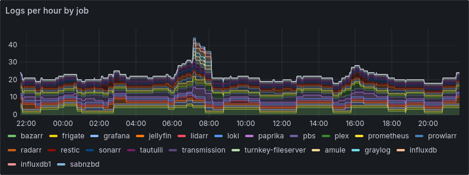

# pve2otelcol

**pve2otelcol** is a program to monitor the VMs running on a [Proxmox Virtual Environment](https://www.proxmox.com/) (*PVE*) node, collecting their logs and sending them to an [OpenTelemetry collector](https://opentelemetry.io/), trying to be as little intrusive as possible.

This means that no agent is needed on individual VMs: logs are collected by a program running on the PVE node itself.

**pve2otelcol** can monitor the [journald](https://www.freedesktop.org/software/systemd/man/latest/systemd-journald.service.html) logs of the PVE node and of each running VM, periodically monitoring them for start and stop events.

The logs, connected in JSON format, are parsed and sent to the OpenTelemetry collector where they can be easily routed, parsed, filtered, inspected and visualized directly in Grafana.

## Disclaimer and limitations

This software is in alpha state; ideas for improvements can be [discussed on Github](https://github.com/alberanid/pve2otelcol/discussions); in the same way, any [bug report](https://github.com/alberanid/pve2otelcol/issues) and pull request is welcome.

At the moment **it can't monitor Qemu/KVM virtual machines**, since running `qm exec VMID -- journalctl --follow` produces no output to be parsed (it's not a stream like the `pct exec VMID -- journalctl --follow` that's used to monitor LXC containers).

## Building it

Just run:

```sh
go build .
```

## Run it

Copy it to a PVE node and run:

```sh
./pve2otelcol --verbose --otlp-grpc-url http://collector.address:4317
```

where *collector.address:4317* is the address and port of an [OpenTelemetry gRPC](https://opentelemetry.io/docs/specs/otlp/) collector.

A popular collector is [Grafana Alloy](https://grafana.com/oss/alloy-opentelemetry-collector/), which is usually deployed along with [Grafana Loki](https://grafana.com/docs/loki/latest/) and the [Grafana visualizer](https://grafana.com/oss/grafana/).

**pve2otelcol** has numerous other command line options, see `./pve2otelcol --help` for more information. The defaults should be reasonable values in most of the cases.

### Systemd unit

To better integrate it with your PVE node, you can use the provided systemd unit file.

A quick guide, to be run as root (do not forget to edit the pve2otelcol.service beforehand, to point it to your OpenTelemetry collector):

```sh
cp pve2otelcol /usr/local/bin/
chmod 755 /usr/local/bin/pve2otelcol
cp goodies/pve2otelcol.service /etc/systemd/system/
systemctl daemon-reload
systemctl enable pve2otelcol.service
systemctl start pve2otelcol.service
```

## Alloy and Loki configuration

While the setup of Alloy and Loki is well outside the scope of this document, here you can find a skeleton configuration file for both of them.

```text
// Sample config for Alloy.
//
// For a full configuration reference, see https://grafana.com/docs/alloy
logging {
  level = "warn"
}

prometheus.exporter.unix "default" {
  include_exporter_metrics = true
  disable_collectors       = ["mdadm"]
}

prometheus.scrape "default" {
  targets = array.concat(
    prometheus.exporter.unix.default.targets,
    [{
      // Self-collect metrics
      job         = "alloy",
      __address__ = "127.0.0.1:12345",
    }],
  )

  forward_to = []
}

otelcol.receiver.otlp "default" {
  grpc {
    endpoint = "0.0.0.0:4317"
    keepalive {}
  }

  http {
    endpoint = "0.0.0.0:4318"
  }

  output {
    logs = [otelcol.processor.batch.default.input]
  }
}

otelcol.processor.batch "default" {
  output {
    logs = [otelcol.exporter.loki.default.input]
  }
}

otelcol.exporter.loki "default" {
  forward_to = [loki.write.local.receiver]
}

loki.write "local" {
  endpoint {
    url = "http://localhost:3100/loki/api/v1/push"
  }
}
```

```yaml
# Sample config for Loki.
# For a full configuration reference, see https://grafana.com/docs/loki/latest/configure/
auth_enabled: false

server:
  http_listen_port: 3100
  grpc_listen_port: 9096
  log_level: warn
  grpc_server_max_concurrent_streams: 1000

common:
  instance_addr: 127.0.0.1
  path_prefix: /var/lib/loki
  storage:
    filesystem:
      chunks_directory: /var/lib/loki/chunks
      rules_directory: /var/lib/loki/rules
  replication_factor: 1
  ring:
    kvstore:
      store: inmemory

ingester_rf1:
  enabled: false
query_range:
  results_cache:
    cache:
      embedded_cache:
        enabled: true
        max_size_mb: 100

schema_config:
  configs:
    - from: 2020-10-20
      store: tsdb
      object_store: filesystem
      schema: v13
      index:
        prefix: index_
        period: 24h

pattern_ingester:
  enabled: true
  metric_aggregation:
    enabled: true
    loki_address: localhost:3100

ruler:
  alertmanager_url: http://localhost:9093

frontend:
  encoding: protobuf
```

After that, you can start **pve2otelcol** and point it to the Alloy collector and then add the Loki data source in Grafana and begin creating dashboards.

## Grafana dashboards examples

### view logs by severity level


### view logs by VM



### show the last logs


### dig-down the content of a single log entry


## Copyright and license

2024 Davide Alberani <da@mimante.net>

Released under the Apache 2 license.
